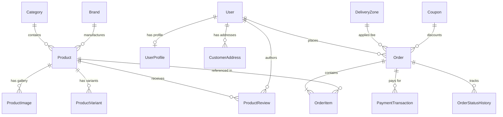

# ARCHITECTURE & SYSTEM DESIGN — ORTHOBEST CARE HUB

## 1. Technology Stack
* **Language & Framework:** Python 3.14+ / Django 6.1+
* **Database:** PostgreSQL (Production) / SQLite3 (Development)
* **Frontend:** Django Templates, Modern Semantic HTML5, CSS Custom Design Tokens, Vanilla JavaScript ES6+ (Modular)
* **Payment Gateways:** M-Pesa (Daraja API STK Push / C2B Simulation), Card Gateway, Cash on Delivery, Manual Bank/Mpesa Till Transfer
* **Caching & Performance:** Django Template Caching, Query optimization (`select_related`, `prefetch_related`), Lazy image loading

---

## 2. Django Apps & Module Responsibilities

```
apps/
├── core/
│   ├── models.py: SiteSettings (Singleton), HomeBanner, TrustBadge
│   ├── middleware.py: LegacyDomainRedirectMiddleware (301 redirects)
│   ├── views.py: HomeView, RobotsTxtView, Custom 404/500/403 handlers
│   └── context_processors.py: site_settings_context
│
├── products/
│   ├── models.py: Category, Brand, Product, ProductImage, ProductVariant, ProductReview
│   ├── views.py: ShopView, CategoryView, ProductDetailView, ProductSearchView, AddReviewView
│   └── forms.py: ProductReviewForm
│
├── cart/
│   ├── cart.py: SessionCart & DBCart abstraction
│   ├── models.py: Cart, CartItem (for persistent carts)
│   ├── views.py: CartDetailView, CartAddAjaxView, CartUpdateAjaxView, CartRemoveAjaxView
│   └── context_processors.py: cart_context
│
├── orders/
│   ├── models.py: DeliveryZone, Coupon, Order, OrderItem, OrderStatusHistory
│   ├── views.py: CheckoutView, OrderConfirmationView, OrderTrackingView
│   └── forms.py: CheckoutForm, CouponApplyForm, OrderTrackForm
│
├── payments/
│   ├── gateways/
│   │   ├── base.py: BasePaymentGateway interface
│   │   ├── mpesa.py: MpesaGateway (STK Push & callback verification)
│   │   ├── card.py: CardPaymentGateway
│   │   └── cod.py: CashOnDeliveryGateway
│   ├── models.py: PaymentTransaction, MpesaPaymentLog
│   └── views.py: PaymentProcessView, MpesaCallbackView, PaymentSuccessView, PaymentCancelView
│
├── accounts/
│   ├── models.py: UserProfile, CustomerAddress
│   ├── views.py: CustomerLoginView, CustomerRegisterView, CustomerLogoutView, AccountDashboardView, OrderHistoryView, AddressManageView
│   └── forms.py: CustomerRegisterForm, CustomerProfileForm, CustomerAddressForm
│
├── content_hub/
│   ├── models.py: Service, BlogPost, BlogCategory, FAQ, LegalPage
│   └── views.py: AboutView, ServicesListView, BlogListView, BlogDetailView, FAQListView, LegalPageView
│
└── leads/
    ├── models.py: ContactMessage, NewsletterSubscriber
    ├── views.py: ContactView, NewsletterSubscribeAjaxView
    └── forms.py: ContactForm, NewsletterForm
```

---

## 3. Database Schema Overview



---

## 4. Payment Gateway Abstraction Design

```python
class BasePaymentGateway:
    def initiate_payment(self, order, request_data):
        """Initiates transaction (e.g. sends STK push or generates redirect)"""
        raise NotImplementedError

    def verify_payment(self, transaction_ref, callback_payload):
        """Validates webhook signature, amounts, and confirms payment"""
        raise NotImplementedError
```

---

## 5. Security & E-commerce Safeguards

1. **Server-Side Price Integrity:** Order subtotal, discounts, and delivery fees are calculated purely on the server against database records.
2. **Payment Callback Idempotency:** Callback payloads are cryptographically signed/verified and stored with transaction IDs preventing double-processing.
3. **Customer Order Isolation:** Non-admin users can only view orders tied directly to their authenticated account, or via secure unguessable tokens/order-number + phone verification for guests.
4. **Form & Data Validation:** Full CSRF protection, strict input cleansing, and Kenyan phone validation (`+254` / `07...` / `01...`).
